<h1 align="center" style="display: flex; align-items: center; justify-content: center; gap: 12px;">
  
  <span style="margin: 0; font-size: 1.2em;">Kizuna Sync</span>
</h1>

<p align="center">
  <strong>Offline-first sync for Supabase</strong><br />
  Rows and media, provisioned into your own project. Pronounced kee-zoo-nah (絆). The word is the bonds that tie people together.
</p>

<p align="center">
  <a href="LICENSE"></a>
  <a href="CHANGELOG.md"></a>
  <a href="packages/protocol/README.md"></a>
  <a href="CONTRIBUTING.md"></a>
</p>

<p align="center">
  <a href="https://kizunasync.com">Website</a> ·
  <a href="https://kizunasync.com/docs">Docs</a> ·
  <a href="https://kizunasync.com/compare">Compare</a> ·
  <a href="#get-started">Install</a> ·
  <a href="#documentation">Docs in repo</a>
</p>

<p align="center">
  
</p>

## What Kizuna is

Kizuna gives a Supabase app a local [SQLite](https://grokipedia.com/page/SQLite) database. You keep reading and writing while the device is offline. A SQLite-backed [outbox](./docs/resources/glossary.md#outbox) holds those writes until they reach your project. Pull is incremental and fenced. Push is transactional. Conflict resolution is column-level. Files travel on a separate attachment queue.

The server half is a readable SQL pack you install into the Supabase project you own. Your project's authentication and [Row Level Security](https://supabase.com/docs/guides/database/postgres/row-level-security#grants-and-policies) stay in charge. Kizuna adds its own schema, ledgers, RPCs, and change log. It attaches a change-tracking trigger to each table you register. Your rows keep their columns. Your policies stay the ones you wrote.

Local `select`, `insert`, `update`, and `delete` run through a Supabase-shaped offline query subset. Each mutation comes back with a [verdict](./docs/resources/glossary.md#verdict) or a rejection record. Polling drives sync. Optional Realtime [wake-ups](./docs/resources/glossary.md#wake-up) are a hint.

Attachments upload and download on their own queue. A Supabase upload of at most 6 MiB uses the [standard Storage request](https://supabase.com/docs/guides/storage/uploads/standard-uploads#uploading). A larger one uses a [resumable TUS session](https://supabase.com/docs/guides/storage/uploads/resumable-uploads#upload-url) in 6 MiB chunks.

Browser, vanilla JavaScript, [Expo](https://expo.dev), [React Native](https://reactnative.dev), React, [Vue](https://vuejs.org), Swift, and Kotlin each have an integration. One Rust engine runs behind all of them. It reaches Node and Bun through [N-API](https://nodejs.org/api/n-api.html), React Native, Swift, and Kotlin through [UniFFI](https://mozilla.github.io/uniffi-rs/), and the browser driver's worker as [WebAssembly](https://grokipedia.com/page/WebAssembly). The JavaScript app client opens that engine on its first use, and when the runtime's artifact cannot load, that first use fails with `ENGINE_UNAVAILABLE` and names what to install.

Whether the outbox survives an abrupt kill depends on the engine's SQLite store (WAL journal mode) and the platform underneath it; a driver only locates the database file. [Project status](./docs/getting-started/status.md) lists the current limitations. The [Roadmap](./docs/resources/roadmap.md) covers the planned work.

## Get started

Run `kizunasync` inside your own Supabase application project.

```bash
cd /path/to/your-supabase-app
npx kizunasync init
```

`pnpm dlx kizunasync`, `yarn dlx kizunasync`, and `bunx kizunasync` work the same way.

The [Quick start](./docs/getting-started/quickstart.md) walks through the dry run, the apply, `doctor`, and `status`. Against a local stack `kizunasync` writes migrations for the [Supabase CLI](https://supabase.com/docs/guides/local-development#cli) to apply. Against a hosted project it uses the Management API. [Install](./docs/cli/install.md) documents every transport and credential.

Once the project is provisioned, wire the client for your UI with the `kizunasync` npm package, the `KizunaSync` Swift package from `https://github.com/kizunasync/kizunasync-swift`, or `com.kizunasync:kizunasync` from Maven Central.

```ts
// src/kizunasync.ts
import { byOwner, defineConfig } from 'kizunasync'
import { createSupabaseKizunaSync } from 'kizunasync/supabase'
import { createWebWorkerDriver } from 'kizunasync/web'
import type { Database } from './database.types'
import { supabase } from './supabase-client'

const config = defineConfig<Database>({
  tables: { todos: { sync: 'read-write', bucket: byOwner('user_id') } },
})

export const kizunasync = createSupabaseKizunaSync({ supabase, driver: createWebWorkerDriver('kizunasync-todos.db'), config })
```

```ts
// src/todos.ts
import { kizunasync } from './kizunasync'

const { data } = await kizunasync.from('todos').select('*').eq('done', false)
await kizunasync.from('todos').insert({ title: 'works on a plane' })
```

Both calls answer from the local database, and the engine fills `user_id` with the signed-in Supabase user, so the insert leaves it out.

## Documentation

The docs render at [kizunasync.com/docs](https://kizunasync.com/docs) from the Markdown in this repository.

| Group | Contents |
|---|---|
| [Getting started](./docs/getting-started/introduction.md) | Introduction, quick start, how Kizuna works, the React, Vue, Vite, Expo, vanilla JavaScript, Swift, and Kotlin guides, playground, and project status |
| [Sync](./docs/sync/offline-writes.md) | Offline writes, sync rules and buckets, validate writes, conflict resolution, the consistency model, collaborative fields, server-side validation, protocol overview, and fencing |
| [Attachments](./docs/attachments/media-and-attachments.md) | The attachment column, the file and transfer ports, upload and download, and Storage policies |
| [CLI & provisioning](./docs/cli/cli.md) | The `kizunasync` commands, install, configuration, what is installed in Supabase, managing synced tables, the local stack, upgrading, and removal |
| [Testing & operations](./docs/operations/test-offline-behavior.md) | Testing offline behavior, troubleshooting by symptom, and the CI and CD gates |
| [Reference](./docs/reference/javascript/introduction.md) | The JavaScript, React, Vue, Expo, Swift, and Kotlin client references, plus the SQL pack, the protocol, drivers and the TCK, and the status taxonomy |
| [Resources](./docs/resources/architecture.md) | Architecture, design trade-offs, protocol decisions, repository layout, native packaging, glossary, roadmap, contributing, and governance |

## Develop Kizuna Sync

To work on the engine, the CLI, the docs, or the protocol, clone this monorepo. The tree pins [Bun](https://bun.sh/docs/installation) `1.4.2`. [Docker](https://docs.docker.com/get-started/get-docker/) is needed only for the maintainer's local Supabase stack, and only where that stack does not run on its [native runtime](./docs/cli/local-supabase.md#1-start-the-stack) on Linux or on macOS on Apple silicon.

```bash
git clone https://github.com/kizunasync/kizunasync.git
cd kizunasync
bun install
```

[Contribute](./docs/resources/contribute.md) lists the checks a pull request has to pass. The [Playground](./docs/getting-started/playground.md) runs the examples.

## Examples

| Example | What it verifies |
|---|---|
| [`examples/todo-expo`](./examples/todo-expo) | Expo SQLite, React hooks, session persistence, attachments, and the React Native UniFFI path when linked |
| [`examples/todo-react`](./examples/todo-react) | React, the browser worker driver, offline mutations, and Supabase Realtime wakeups |
| [`examples/todo-vue`](./examples/todo-vue) | Vue composables over the same browser integration |
| [`examples/todo-ios`](./examples/todo-ios) | Swift app client over the generated UniFFI package, with host tests and a simulator app |
| [`examples/todo-android`](./examples/todo-android) | Kotlin app client over the generated UniFFI package, with host tests and an Android app module |

The [Playground](./docs/getting-started/playground.md) lists the prerequisites and commands for each project.

## Monorepo layout

[Repository layout](./docs/resources/repository-layout.md) is the public map of the kernel, the bridges, the app clients, the crates, and the packages.

## Governance and licensing

[GOVERNANCE.md](./GOVERNANCE.md) records the project's compatibility, protocol, licensing, and telemetry commitments. The engine, drivers, framework bindings, CLI, inspector, and protocol sources are Apache-2.0. The server SQL pack under `packages/supabase-pack` uses PolyForm Shield 1.0.0. The current clients contain no telemetry path.

## Community and contributing

- [GitHub Discussions](https://github.com/kizunasync/kizunasync/discussions) is the place for questions, design feedback, and RFCs.
- [CONTRIBUTING.md](./CONTRIBUTING.md) documents DCO sign-off, the repository checks, and the pull request workflow.

## Sponsors

Sponsorship supports maintainer time and the conformance program. See [.github/FUNDING.yml](.github/FUNDING.yml) or write to kizunasync@smartsquad.io for corporate support.

## Author

<p>
  <a href="https://x.com/massimodeluisa"></a>
  <a href="https://github.com/kizunasync"></a>
</p>

**Kizuna Sync** · Smart Squad S.r.l.: [kizunasync.com](https://kizunasync.com) · [kizunasync@smartsquad.io](mailto:kizunasync@smartsquad.io)

## License

Apache-2.0 covers the engine, drivers, bindings, CLI, inspector, and protocol, as [LICENSE](LICENSE) states. The server SQL pack under `packages/supabase-pack` uses PolyForm Shield 1.0.0. [GOVERNANCE.md](GOVERNANCE.md) has the details.
