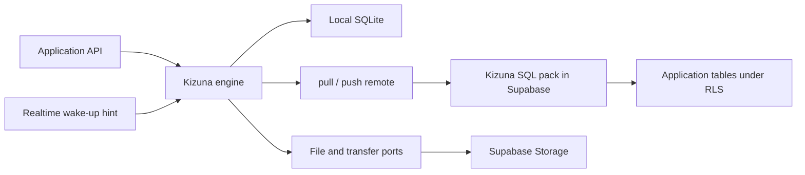

# Architecture

A Kizuna deployment has two halves. On the device, the engine answers screens from local SQLite. In the Supabase project you own, the [SQL pack](./glossary.md#sql-pack) speaks the sync protocol. Nothing of Kizuna's runs between them: row sync exchanges JSON with [Postgres](https://grokipedia.com/page/PostgreSQL), and attachment bytes travel through Supabase Storage on a separate channel.

## Kernel, bridges, and app clients

Kizuna keeps three layers distinct, and every application language sits on the same bottom one:

| Layer | What it is | Where it lives |
|---|---|---|
| [Kernel](./glossary.md#kernel) | `SyncEngine` | `crates/kizunasync-engine` |
| [Bridge](./glossary.md#bridge) | JSON plus a handle | `crates/kizunasync-ffi` (UniFFI), `crates/kizunasync-napi` (N-API), `crates/kizunasync-wasm` (browser worker) |
| [App client](./glossary.md#app-client) | Typed API in the app language | `createKizunaSync` (JavaScript); `KizunaSyncClient` (Swift and Kotlin) |

One Rust kernel does the synchronization work. Swift and Kotlin ship as generated [UniFFI](https://mozilla.github.io/uniffi-rs/) packages over `KizunaSyncEngine`, and they never call `selectEngine`. JavaScript reaches the same kernel through a compiled [N-API](https://nodejs.org/api/n-api.html) addon or a compiled [WebAssembly](https://grokipedia.com/page/WebAssembly) worker. `selectEngine` lives inside the app client `createKizunaSync` returns, and it only chooses which of those compiled artifacts to load. It runs once, on the app client's first engine call rather than when the client is created, and it reads an engine carried by the [driver](./glossary.md#driver) first. That is how web, Vite, and [Expo](https://expo.dev) web all run the kernel in the browser driver's worker. Failing that, it picks UniFFI on [React Native](https://reactnative.dev) when the React Native module in `kizunasync` is linked. It picks N-API on [Node](https://grokipedia.com/page/Node.js) and [Bun](https://bun.sh) when the addon loads. The driver names the store as `databasePath`, or `null` for a private in-memory database. In every other case that first call fails with `ENGINE_UNAVAILABLE` and the client keeps that failure, rather than running a second implementation, and [Project status](../getting-started/status.md#engine-selection) lists the lanes.

There is no Rust app client. The kernel is embedder SPI in private workspace crates (`publish = false`). The [`kizunasync`](../cli/cli.md) CLI provisions the SQL pack rather than syncing rows, so it is not an app client either. [Kernel and app clients](../getting-started/how-kizuna-works.md#kernel-and-app-clients) covers the same split for application code, and [Repository layout](./repository-layout.md) names the paths, crates, and imports.

The local store is `rusqlite` inside the kernel on every runtime. Swift and Kotlin are thin UniFFI hosts: they pass `databasePath` and a complete `remote`, and HTTP runs in Rust. On the JavaScript N-API path the kernel opens that same `rusqlite` store; HTTP is the exception, because the addon calls back into the host remote so [supabase-js](https://supabase.com/docs/reference/javascript/introduction) can attach the session.

The shared [conformance corpus](./glossary.md#conformance-corpus) and conflict vectors check the one engine's behavior on each runtime that runs it. They do not stand in for platform-specific storage and lifecycle testing, which [Match the test to the claim](../operations/test-offline-behavior.md#6-match-the-test-to-the-claim) separates case by case.

## The engine and its ports

The kernel owns local queries on every runtime: a `select`, `update`, or `delete` sends its plan or its target filters across the bridge, and the kernel resolves rows, sort, limit, projection, and write targets there, never in the host language. The kernel also owns the [outbox](./glossary.md#outbox), push and pull orchestration, [checkpoint](./glossary.md#checkpoint) application, rejection handling, and the attachment queue. Everything platform-specific sits behind a port the host supplies: five that do work and three that only hint. On the JavaScript host all eight are exported:

| Port | Responsibility |
|---|---|
| `IStoreLocator` | Names the SQLite file the kernel opens, or hands over an engine the driver already runs; it can carry the loader for the engine a React Native build links, and the platform's connectivity and foreground ports |
| `IProtocolRemote` | The `pull` and `push` row-sync calls |
| `IFileStore` | Local attachment bytes |
| `ITransfer` | Attachment upload, download, confirmation, and cleanup |
| `IEngineTransport` | The call surface a driver-provided engine exposes, for the browser worker |
| `IWakeup` | A hint that a pull may find new work |
| `IConnectivity` | A hint about network state |
| `IForeground` | A hint that the app became visible again |

On JavaScript those ports are how the host talks to the kernel. A locator names the database the kernel opens, or hands over an engine it already runs; the kernel owns the only connection to it, and no host code executes SQL against it. The three hints carry no data and no correctness obligation. `IConnectivity` can hold attempts back while the device is offline and ask for a flush on reconnection, and `IForeground` lets the adapter that owns the session refresh the [JWT](https://grokipedia.com/page/JSON_Web_Token) and sync when a tab or app returns to view. A driver that knows its platform's signals hands them over as `platformPorts` on the locator, so an app passes a connectivity or foreground port only to replace the driver's. [Drivers and the TCK](../reference/drivers-and-tck.md#port-model) documents what an implementation of each port owes the engine.

On Swift and Kotlin those ports live inside the thin client, configured with `databasePath`, `remote`, and an optional `attachmentRoot`.

## The local data path

A local mutation changes the application row and enqueues its outbox record in one local database transaction, so a queued write and the row it produced always land together. The engine pushes queued mutations in issue order, reconciles the returned [verdicts](./glossary.md#verdict), then pulls server changes. [Offline writes](../sync/offline-writes.md) follows one such write from the tap to the toast.

A paginated pull stages its pages until the response closes the checkpoint boundary. Rows, tombstones, the final cursor, and the staging cleanup commit together in one local transaction. When the outbox is not empty the checkpoint commits all the same. The engine replays the pending mutations over the committed snapshot inside that same transaction, so incoming server state never replaces an unconfirmed local value. [Checkpoints](../sync/consistency-model.md#checkpoints) states the guarantee that rests on this.

Those are transaction-level properties of the engine. The repository holds no complete kill-test matrix across every driver and platform, so they are not a claim that every supported storage stack survives process or device loss mid-write.

## The server data path

The installed SQL pack owns the global change sequence, the change and [tombstone](./glossary.md#tombstone) ledgers, [cursor](./glossary.md#cursor) and retention state, per-mutation verdict records, [Hybrid Logical Clock](./glossary.md#hybrid-logical-clock-hlc) metadata, the opt-in server-side conflict journal, attachment metadata, and the functions over them. When you provision a table, the pack also attaches change-tracking [triggers](https://supabase.com/docs/guides/database/postgres/triggers#creating-a-trigger) to it, the same Postgres mechanism Supabase documents. Kizuna adds no columns to your rows, and it replaces none of your policies.

The authenticated SQL surface contains five public functions:

| Function | Role |
|---|---|
| `kizunasync.pull` | Downloads row changes and tombstones |
| `kizunasync.push` | Applies queued row mutations and returns verdicts |
| `kizunasync.attachment_confirm` | Records integrity metadata after an object upload |
| `kizunasync.attachment_metadata` | Returns integrity metadata a peer can already see under RLS |
| `kizunasync.attachment_vacuum` | Removes caller-owned attachment metadata |

Only `pull` and `push` carry row-sync traffic. Attachment bytes ride neither response. [What Kizuna installs](../cli/whats-installed.md#the-public-rpcs) itemizes the whole schema, and the [SQL pack](../reference/sql-pack.md) reference gives each object its signature.

All five are [`SECURITY DEFINER`](https://supabase.com/docs/guides/database/functions#security-definer-vs-invoker), which Supabase describes as running with the privileges of the function's owner. The wrappers need that privilege to reach Kizuna's private ledgers, and they are not the authorization boundary for your rows: reads and writes of application rows are delegated to helpers owned by the `kizunasync_rls` role, which is `NOBYPASSRLS`, inherits the authenticated role, and evaluates the caller's own [Row Level Security](https://supabase.com/docs/guides/database/postgres/row-level-security#grants-and-policies) policies. [Buckets](./glossary.md#bucket) narrow which rows a pull considers; they never grant access to one.

## Change capture, cursors, and wake-ups

Configured tables share one server-side change sequence, and the SQL pack draws each change's number when the writing transaction commits, one committing transaction at a time. A pull takes a Postgres snapshot and advances to the largest sequence number visible in it. That number is a safe [consistency horizon](./glossary.md#consistency-horizon), because no later commit can land below it. The cursor stays an opaque text token. The client persists it and returns it without reading it. [Fencing and horizons](../sync/fencing-and-horizons.md#the-live-sql-horizon) works through the race this rule closes and what it costs.

Database triggers also broadcast a Realtime [wake-up](./glossary.md#wake-up) hint. Supabase calls the mechanism [broadcast from the database](https://supabase.com/docs/guides/realtime/broadcast#broadcast-from-the-database). Kizuna uses it as a signal that carries no pages. The deployed adapter listens on private `kizunasync:<table>` topics for the `changed` event and discards the payload. That spelling is not frozen as protocol bytes, because the wake-up channel and payload decision remains open (D-wakeup-channel), as [Protocol decisions](./protocol-decisions.md#blocked-decisions) records. A missed hint costs latency and nothing else, because scheduled pulling remains the correctness path.

## Attachment transport

Rows carry attachment references, Kizuna's own attachment metadata records the integrity fields, and object bytes go through Storage on their own lifecycle. The Supabase transfer adapter picks a [standard upload](https://supabase.com/docs/guides/storage/uploads/standard-uploads#uploading) for objects up to 6 MiB, and a [resumable TUS upload](https://supabase.com/docs/guides/storage/uploads/resumable-uploads#upload-url) in 6 MiB chunks above that. Kizuna persists the session URL Supabase hands back, so an interrupted upload asks the server how much already arrived instead of starting again. Unit and fake-transport tests cover session creation and resume, and the live TUS test is opt-in. This is therefore a resume path rather than a promise that every platform survives being killed mid-upload. [Media attachments](../attachments/media-and-attachments.md#5-bytes-upload-after-the-outbox-drains) shows the queue from the application side.

## Operational boundaries

Kizuna operates no data-plane service between the device and the project. Availability, RLS correctness, database limits, Storage policy, retention, and backup posture stay properties of your Supabase project and how you run it.

Each layer of evidence covers its own layer. The wire corpus validates protocol behavior, port tests validate adapter contracts, and browser, device, multi-process, and kill tests validate physical behavior. Passing one is not evidence for the others, and [Project status](../getting-started/status.md) records which of them exist.

## Related pages

- [Repository layout](./repository-layout.md)
- [Client library comparison](../reference/client-libraries.md)
- [Swift: Introduction](../reference/swift/introduction.md)
- [Protocol overview](../sync/protocol-overview.md)
- [Consistency model](../sync/consistency-model.md)
- [Drivers and the TCK](../reference/drivers-and-tck.md)
- [Fencing and horizons](../sync/fencing-and-horizons.md)
- [Protocol reference](../reference/protocol.md)
