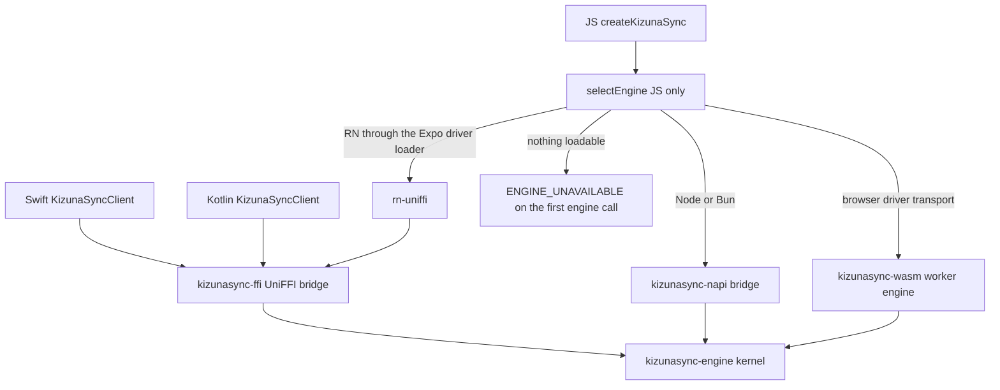

# Repository layout

The monorepo has three product layers: the Rust kernel, the language bridges, and the app clients. [Architecture](./architecture.md) covers what those layers do while an application runs.

Nothing in this tree is a published registry package. Every workspace is version `0.2.6-alpha.2`. Most JavaScript workspaces are publishable; `@kizunasync/utilities`, `@kizunasync/ui`, `@kizunasync/protocol`, and `@kizunasync/supabase-pack` stay private. Rust crates carry `publish = false`. [Project status](../getting-started/status.md#surface-matrix) records that state surface by surface.

## Three layers

| Layer | What it is | Where it lives |
|---|---|---|
| [Kernel](./glossary.md#kernel) | `SyncEngine`: apply, pull, push, query, outbox, attachments | `crates/kizunasync-engine` |
| [Bridge](./glossary.md#bridge) | JSON plus a handle over the kernel | `crates/kizunasync-ffi` (UniFFI), `crates/kizunasync-napi` (N-API), and `crates/kizunasync-wasm` (browser worker) |
| [App client](./glossary.md#app-client) | Typed API in the app language | `createKizunaSync` in `@kizunasync/core`; `KizunaSyncClient` in Swift and Kotlin |

Swift and Kotlin are [FFI](https://grokipedia.com/page/Foreign_function_interface) hosts rather than kernel hosts. `KizunaSyncClient` wraps the generated [UniFFI](https://mozilla.github.io/uniffi-rs/) `KizunaSyncEngine`, serializes `KizunaSyncClientConfig` to JSON, and hops off the calling thread. It is the native counterpart of `createKizunaSync`, not of `SyncEngine`.

`selectEngine` runs inside the app client `createKizunaSync` returns, on its first engine call, and it exists in JavaScript alone. It chooses which artifact reaches the one kernel: a transport the driver already carries, a React Native UniFFI handle that the host injects or the driver's `loadNativeEngine` loads, or the [N-API](https://nodejs.org/api/n-api.html) addon. The browser is the first case. `@kizunasync/web` hands a transport to the engine in its worker, so nothing loads on the page and there is no second implementation to weigh. Swift and Kotlin never reach the choice, because their bridge is fixed when the package is linked. [Engine selection](../getting-started/status.md#engine-selection) lists the conditions, and no environment variable changes them.

A bridge is a language crossing in front of the kernel, so a Rust program needs none: it already stands on the kernel's side of that crossing. `kizunasync-engine` is embedder SPI, the interface for code that hosts the engine rather than for an application, and `kizunasync` is the SQL-pack CLI. Neither is a Rust `KizunaSyncClient`, and no public Rust app client exists.



The kernel owns the local [SQLite](https://grokipedia.com/page/SQLite) store through `rusqlite` on every runtime. Swift and Kotlin are generated UniFFI packages. In those packages `rusqlite` and HTTP run in Rust behind `database_path` and the `http` feature, and the host keeps the [JWT](https://grokipedia.com/page/JSON_Web_Token) and the typed app client. On the JavaScript N-API path the same `rusqlite` store opens inside the compiled addon. HTTP is the exception there, because Rust calls back into the host remote so supabase-js can attach the session. The JavaScript locator reports `databasePath` so the kernel opens the same file the app named. [Drivers and the TCK](../reference/drivers-and-tck.md#port-model) documents what an implementation of each port owes the engine.

One kernel answers every app client, and the native clients are peers of the JavaScript one rather than descendants of it. The browser is no exception: `kizunasync-wasm` compiles the kernel to [WebAssembly](https://grokipedia.com/page/WebAssembly) and `@kizunasync/web` runs it in a dedicated worker, which is what Vite apps and Expo web both open.

The product [`kizunasync`](../cli/cli.md) CLI is a sibling surface: it provisions the SQL pack and never sits on the app-client path. Readers invoke it with `npx kizunasync`, `pnpm dlx kizunasync`, `yarn dlx kizunasync`, or `bunx kizunasync`, and [`packages/cli`](../../packages/cli) is the Node shim that execs that binary.

## Tree

```text
apps/website            documentation and marketing site
apps/sync-inspector     read-only local sync inspector
apps/demo               two-pane browser demo (not under examples/)
crates/                 Rust kernel, bridges, CLI, conformance
packages/core           JS app client (createKizunaSync), host layer, wire types, ports
packages/cli            thin JavaScript shim for the Rust kizunasync binary
packages/supabase       RPC remote, Storage/TUS transfer, Realtime wakeup
packages/supabase-pack  installable SQL pack plus local fixtures
packages/web            worker driver over kizunasync-wasm, OPFS file store, connectivity
packages/expo           Expo SQLite and op-sqlite drivers, file store, connectivity
packages/rn-uniffi      React Native Turbo Module loader for UniFFI
packages/protocol       wire schemas, decisions, corpus, TypeScript oracle
packages/react          React provider and hooks
packages/vue            Vue composables
packages/ui             shared theme tokens and cross-app components
packages/utilities      query log, live-sync gate and wrappers, demo accounts, todo-board predicates
scripts/                XCFramework, AAR, bindgen, and npm release scripts
branding/               logo, app marks, favicons, and the brand book
docs/                   public documentation rendered by the website
examples/               five reference apps (React, Vue, Expo, iOS, Android)
```

## Crates

The workspace builds twelve crates.

| Crate | Role |
|---|---|
| [`kizunasync-protocol`](../../crates/kizunasync-protocol/README.md) | Wire types and cursor codec |
| [`kizunasync-query`](../../crates/kizunasync-query/README.md) | Local query filter evaluation |
| [`kizunasync-store`](../../crates/kizunasync-store/README.md) | SQLite local store (`_kizunasync_*`) |
| [`kizunasync-transfer`](../../crates/kizunasync-transfer/README.md) | Attachment transfer (single-shot and [TUS](https://tus.io/protocols/resumable-upload)) |
| [`kizunasync-engine`](../../crates/kizunasync-engine/README.md) | Kernel |
| [`kizunasync-remote-http`](../../crates/kizunasync-remote-http/README.md) | Live HTTP adapters for [Supabase](https://supabase.com) RPC and Storage |
| [`kizunasync-conformance`](../../crates/kizunasync-conformance/README.md) | Protocol corpus harness for the Rust engine |
| [`kizunasync-ffi`](../../crates/kizunasync-ffi/README.md) | UniFFI and C-ABI bridge; Swift and Kotlin packages under `bindings/` |
| [`kizunasync-napi`](../../crates/kizunasync-napi/README.md) | Node and [Bun](https://bun.sh) N-API bridge |
| [`kizunasync-wasm`](../../crates/kizunasync-wasm/README.md) | Browser bridge; the kernel as WebAssembly behind `@kizunasync/web`'s worker |
| [`kizunasync-bindgen`](../../crates/kizunasync-bindgen/README.md) | UniFFI bindgen CLI |
| [`kizunasync-cli`](../../crates/kizunasync-cli/README.md) | Product CLI crate; binary name `kizunasync` |

An application imports one app client and its platform packages, never a crate.

| App | Import |
|---|---|
| React / [Vue](https://vuejs.org) / Vite / vanilla browser | `createKizunaSync` or `createSupabaseKizunaSync`, plus `@kizunasync/web` |
| Expo / React Native | `createKizunaSync` plus `@kizunasync/expo`; UniFFI when `@kizunasync/rn-uniffi` is linked |
| Native iOS | `import KizunaSync`, then `KizunaSyncClient` |
| Native Android | `com.kizunasync.kizunasync.KizunaSyncClient` |
| Provisioning | the `kizunasync` CLI through a package-manager runner |

## Related pages

- [Architecture](./architecture.md)
- [Swift and Kotlin](../getting-started/native-clients.md)
- [Swift: Introduction](../reference/swift/introduction.md)
- [CLI](../cli/cli.md)
- [Expo / React Native](../getting-started/expo.md)
- [Project status](../getting-started/status.md)
