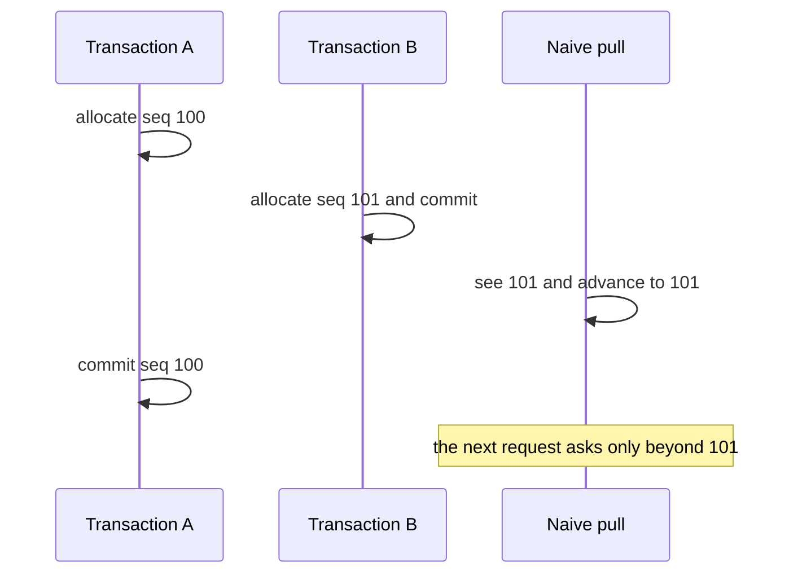

# Fencing and horizons

A [consistency horizon](../resources/glossary.md#consistency-horizon) is the highest position a pull may resume from. It stays below every change the client has not received, and [fencing](../resources/glossary.md#fencing) is the rule that keeps it there. The SQL pack fences by numbering each change when its transaction commits, which makes the largest sequence number a pull's snapshot can see a safe place to resume.

[Postgres](https://grokipedia.com/page/PostgreSQL) makes a row visible when its transaction commits. A sequence number drawn earlier, while the statement runs, can therefore be lower than a number another transaction has already committed, and a cursor that trusts the largest visible number steps over it for good. Numbering each change at commit makes the order of the numbers follow the order of the commits.

## The late-commit race

The race needs sequence numbers drawn at write time. Suppose transaction A records sequence 100 and stays open while transaction B records sequence 101 and commits. A pull that reads the largest visible sequence sees 101, saves it as the new [cursor](../resources/glossary.md#cursor), and asks only for positions above 101 next time. When A finally commits, sequence 100 lands behind the cursor and no later request covers it.

Drawing each number at commit removes the race. Transaction A has no number while it stays open, and when it commits it draws one above 101, so the next pull finds it.

## The live SQL horizon

[`kizunasync.track_change`](../reference/sql-pack.md#kizunasynctrack_change) and [`kizunasync.track_delete`](../reference/sql-pack.md#kizunasynctrack_delete) queue each row change and delete in `kizunasync._change_pending` without numbering it. A deferred constraint trigger, `kizunasync._stamp_change`, numbers every queued change as the writing transaction commits, while it holds one transaction-scoped advisory lock. It writes each numbered change to [`kizunasync._changelog`](../reference/sql-pack.md#kizunasync_changelog), or to [`kizunasync._tombstones`](../reference/sql-pack.md#kizunasync_tombstones) for a delete.

Postgres makes a committing transaction visible before it releases its locks, so a transaction draws its numbers only after every transaction that drew before it is visible or aborted. The numbers any snapshot sees therefore form a gapless prefix, apart from numbers an aborted commit consumed. [`kizunasync.pull`](../reference/sql-pack.md#kizunasyncpull) takes one snapshot per run and advances the cursor to the largest sequence number visible in it. That number is the consistency horizon for the pull, because no later commit can land below it. The page that closes the checkpoint returns it as a flat cursor, and the pack still honors a composite one.

An open transaction has no sequence number yet, so it never holds back other commits. A change is deliverable as soon as its transaction's commit is visible, however long another transaction stays open. A number an aborted commit consumed stays a gap that no row fills, and the cursor passes over it.

## What commit-time numbering costs

Numbering at commit puts the price of fencing on writes. Transactions that change synced tables run their commit step one at a time, including the flush of the write-ahead log, so synced-write commits per second have a ceiling that depends on how fast the disk flushes. Transactions that touch no synced table never take the lock and are unaffected.

Holding one lock across the commit step has these consequences:

- A transaction that changes many synced rows holds the lock while it numbers them.
- `SET CONSTRAINTS ALL IMMEDIATE` numbers the changes early, which is still correct, and then holds the lock until the transaction commits.
- `PREPARE TRANSACTION` holds the lock until `COMMIT PREPARED` or `ROLLBACK PREPARED`.
- A deferred constraint trigger of your own can deadlock with the lock. Postgres aborts one side, and the client retries.
- `statement_timeout` applies to a `COMMIT` that waits for the lock.
- A session running with `session_replication_role = replica` skips the capture triggers, so the pack records none of that session's changes.
- [`kizunasync._change_seq`](../reference/sql-pack.md#kizunasync_change_seq) keeps `CACHE 1`, and nothing but `kizunasync._stamp_change` may call `nextval` on it. A cached block or a second caller would let a later number land below one that is already visible.

## What the cursor counts

Rows outside the requested [buckets](../resources/glossary.md#bucket) or hidden by [Row Level Security](https://grokipedia.com/page/Row-level_security) are not returned as row images, and their positions in the global sequence can be crossed by the cursor regardless. [Sync rules & buckets](./sync-rules-and-buckets.md#1-understand-the-two-layers) covers why those are two separate filters. The cursor is a position in the shared change history rather than a count of the rows one caller received, so passing a position you may not read is normal and does not mean something was lost. Supabase documents the read side in [SELECT policies](https://supabase.com/docs/guides/database/postgres/row-level-security#select-policies); Kizuna adds the bucket filter above them and never widens what a policy already allows.

Tombstones are bucket-scoped. A pull that names a table receives the deleted primary keys whose stored bucket snapshot matches the request params, and tables with no bucket stay table-scoped. A table provisioned with a bucket column refuses an unscoped pull with `KZL01` before any page is built. That snapshot is the `bucket_snapshot` column on [`kizunasync._tombstones`](../reference/sql-pack.md#kizunasync_tombstones). A matching snapshot is necessary but not sufficient: the pull also withholds the tombstone while the pk's current state is still deliverable to the caller under the requested buckets, and it delivers one only for a bucket value the caller already received a live row of, never for a value the caller has newly named. [Sync rules & buckets](./sync-rules-and-buckets.md#soft-delete) covers the residual that grant-based delivery leaves. The cursor can advance past a delete that was withheld regardless.

## Flat and composite cursors

The protocol defines the cursor as opaque text in four forms, set out in full under [Cursor grammar](../reference/protocol.md#cursor-grammar):

- `"0"` is the bootstrap token.
- A flat token such as `"42"` carries a high-water mark alone.
- A composite token such as `"6~5"` carries high-water 6 with sequence 5 open for re-delivery.
- A continuation token such as `"0:2"` or `"4:9~5.7"` is what a page cut by the limit returns. Its prefix is the start, the checkpoint the transfer began from, so `CHECKPOINT_EXPIRED` judges the whole transfer by that checkpoint and a bootstrap from `"0"` always runs to completion.

This repository holds two implementations of the fencing rule, and they are not the same code. [Fencing implementations](../reference/protocol.md#fencing-implementations) records the split. The installed SQL migration numbers changes at commit, so no later commit can fill a gap below the cursor it returns, and it never emits holes: a closing page gets a flat token and a continuation page gets its start and position. It still honors a composite token it receives.

The reference oracle behind the conformance corpus computes the refined form. It sees in-flight effects in memory, delivers a committed row that sits above an in-flight gap, records that gap as a hole in a composite token, and re-scans the gap once it commits. The two implementations refuse to skip a late commit for different reasons, and both deliver a change as soon as its commit is visible.

Three corpus cases run against the oracle, covering a late commit, a re-delivery, and two simultaneous holes, so they are evidence for the refined model. The SQL evidence is the pack's concurrency tests, `packages/supabase-pack/tests/pull-fencing-*.test.ts`. The [live SQL conformance gate](../operations/ci-cd.md#live-sql-conformance-gate) replays the rest of the corpus against a real Postgres. It pins the held-transaction fencing race as the one `UNSUPPORTED` family a single-connection replay cannot stage.

## Client obligation

The client stores the cursor and returns it verbatim. It never parses, increments, compares, or coerces the token to a number, and sequence fields stay decimal strings even when the cursor uses the composite grammar.

Pull pages stage while `has_more` is true, and a staged page can hold tombstones as well as rows, because both share one `(seq, table, pk)` stream and one `limit`. The page that reaches the end of that stream returns `has_more: false`, including a page that ends with exactly `limit` entries. At the closing boundary the engine applies the staged rows and tombstones, saves the final cursor, and clears staging in one local transaction. The cursor is therefore committed with the data it covers rather than before it, and an error the engine handles cannot publish a cursor for pages that were only partly applied.

[Checkpoint and rebase rules](../reference/protocol.md#checkpoint-and-rebase-rules) states that obligation, and [`getCheckpoint()`](../reference/javascript/checkpoint.md) returns the token a client holds. What survives an abrupt process or device kill depends on the [SQLite](https://grokipedia.com/page/SQLite) driver, and no measurement covers every driver. The [Consistency model](./consistency-model.md) states that same boundary for the checkpoint.

## What the cursor is not

The cursor is not a wall-clock timestamp, a row version, a per-table offset, or a value an application can sort across devices. Two devices holding equal cursor tokens do not hold equal datasets when their RLS or bucket subscriptions differ.

## Related pages

- [Consistency model](./consistency-model.md)
- [Protocol overview](./protocol-overview.md)
- [Protocol decisions](../resources/protocol-decisions.md)
- [Protocol reference](../reference/protocol.md)
